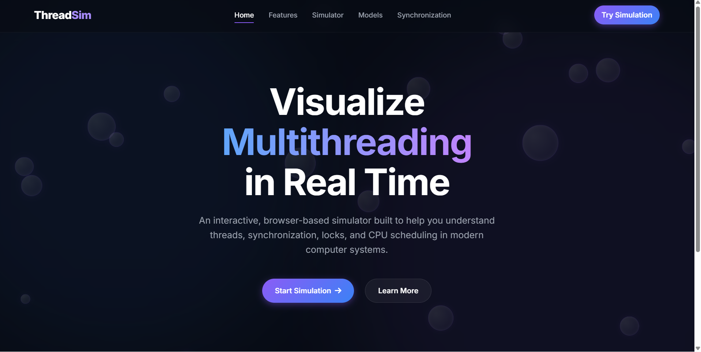
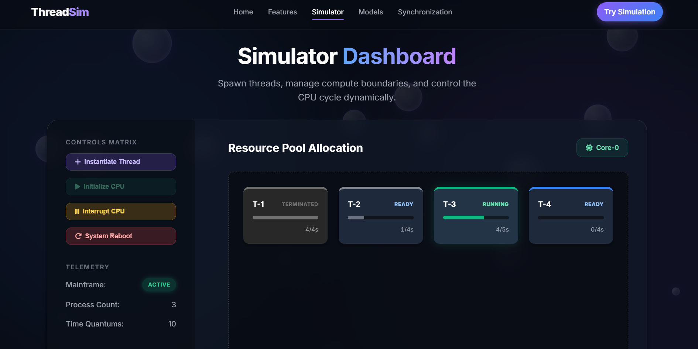
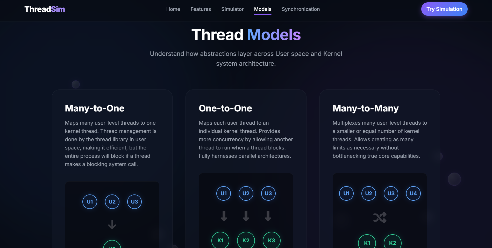
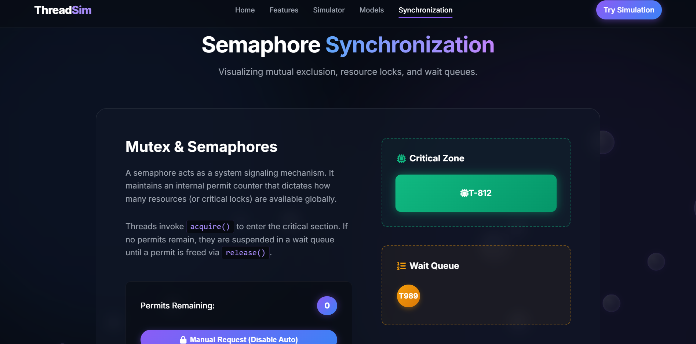

# 🖥️ Operating System Simulator — ThreadSim

An interactive web-based **Operating System Simulator** designed to visualize important Operating System concepts through an intuitive and interactive interface.

The project demonstrates **thread lifecycle, CPU scheduling, thread models, context switching, and semaphore synchronization** using HTML, CSS, and JavaScript.

## 🌐 Live Demo

🔗 **[View Live Demo](https://rajasekhar-odeti.github.io/Operating-System-Simulator/)**

## 🚀 Features

### 🧵 Thread Lifecycle

- Create and manage multiple threads
- Visualize thread states
- Ready, Running, Waiting, and Terminated states
- Track thread execution
- Monitor thread progress

### ⚡ CPU Scheduling

- Interactive CPU execution simulation
- Context switching visualization
- Round Robin-style scheduling
- Time quantum tracking
- CPU status monitoring
- Simulated I/O waiting

### 🔐 Semaphore Synchronization

- Semaphore resource management
- Critical section visualization
- Resource acquisition and release
- Waiting queue simulation
- Semaphore permit tracking
- Mutual exclusion demonstration

### 🧩 Thread Models

The project demonstrates three important thread mapping models:

- Many-to-One
- One-to-One
- Many-to-Many

These visualizations help understand the relationship between user-level threads and kernel-level threads.

### 📊 Real-Time Monitoring

The simulator displays:

- CPU status
- Thread count
- Thread states
- Execution progress
- Time quantums
- Semaphore permits
- Waiting threads

## 📸 Screenshots

### 🏠 Home Page

### ⚡ Thread & CPU Simulator

### 🧩 Thread Models

### 🔐 Semaphore Synchronization

## 🛠️ Technologies Used

- **HTML5**
- **CSS3**
- **JavaScript**
- **Font Awesome**
- **Google Fonts**

## 📂 Project Structure

    Operating-System-Simulator/
    │
    ├── index.html
    ├── features.html
    ├── simulator.html
    ├── models.html
    ├── sync.html
    ├── script.js
    ├── style.css
    ├── README.md
    │
    └── screenshots/
        ├── home.png
        ├── simulator.png
        ├── models.png
        └── synchronization.png

## 🎯 Operating System Concepts

This project provides an interactive visualization of:

- Threads
- Thread Lifecycle
- Thread States
- CPU Scheduling
- Context Switching
- Preemptive Scheduling
- Round Robin Scheduling
- I/O Waiting
- User-Level Threads
- Kernel-Level Threads
- Many-to-One Thread Model
- One-to-One Thread Model
- Many-to-Many Thread Model
- Semaphores
- Mutual Exclusion
- Critical Sections
- Wait Queues
- Resource Synchronization

## ▶️ How to Run Locally

### Clone the Repository

    git clone https://github.com/rajasekhar-odeti/Operating-System-Simulator.git

### Navigate to the Project

    cd Operating-System-Simulator

### Run the Project

Open `index.html` in a modern web browser.

You can also use **VS Code Live Server** to run the project locally.

## 💡 Project Objective

The goal of ThreadSim is to make Operating System concepts easier to understand through **interactive visual simulations** rather than only theoretical explanations.

Users can interact with the simulator and observe thread execution, CPU scheduling, context switching, thread models, and synchronization mechanisms.

## 🔮 Future Enhancements

- FCFS Scheduling
- SJF Scheduling
- Priority Scheduling
- Configurable Time Quantum
- Multiple CPU Core Simulation
- Process Creation and Termination
- Deadlock Detection
- Deadlock Avoidance
- Memory Management Simulation
- Page Replacement Algorithms
- Disk Scheduling Algorithms
- Scheduling Performance Metrics

## 👨‍💻 Author

**Rajasekhar**

Operating System Simulator — ThreadSim

---

⭐ If you find this project useful, consider giving the repository a star!
